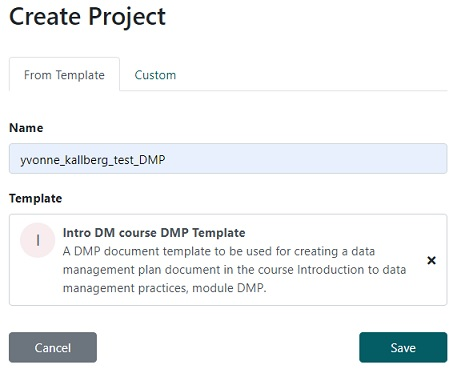
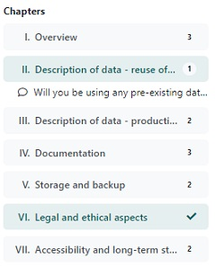
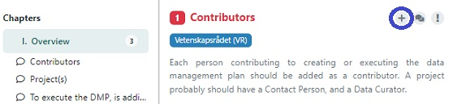
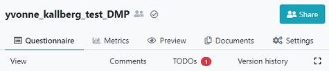

## Instructions
Follow the instructions below in order to get started

* Go to [DS wizard](https://dsw.scilifelab.se/) and log in with your university credentials by clicking on the orange button.

* Click on `Projects` in left-hand margin 

* Click on `Create` in top right corner, name the project `<your_name>_test_DMP`, select knowledge model named `Intro DMP course module…` and click on `Save`

> ## Note
>
> * A knowledge model act as a question database/source. For the purpose of this 
> learning module, a special version has been created, in order to better demonstrate 
> tool. It is not suitable for creating a real data management plan. We recommend to use a knowledge model called 
> SciLifeLab Science Europe / VR DMP, when writing a full DMP.
> 
> * We will (eventually) delete all projects using this course-specific knowledge model.
> 
> * There is a more thourough guide of the wizard in the left-side margin **[Guide - Write a DMP](https://dsw.scilifelab.se/appendix/dsw_instructions/)**
{: .callout}

## About the tool
* The answers will be saved automatically.

*  Under most of the questions you will find guidance or advice on how to answer or what to consider. 

* For some questions you may provide more than one answer. If you want to add a new answer click the `Add` button at the end of your last answer.
 
    * When using `Add` button you might need scroll up in order to get to the first field to be filled.
    
* The DSW provides a filtering feature that allows you to see questions relevant only to a particular phase of a research project. 

    * Make sure the phase `Before Submitting the Proposal` is selected. 
    * Answer the questions in red (these are the questions that should be answered during the selected phase, questions which belong to other phases are in black).

You are now ready to answer the questions using the provided scenario below.

> ## Scenario
>
> **VEGFR2 Y949F mutation**
>
> Principal investigator Sam Smith (sam.smith@example.com) at Uppsala University 
> and [you; as a researcher and contact person], wish to do RNA sequencing of 
> lung tissue from transgenic mice in order to investigate the effect of a single 
> tyrosine to phenylalanine exchange in the endothelial receptor VEGFR2 at 
> position Y949. Dr Smith has applied for funding at Vetenskapsrådet. The project 
> is planned to start 2021-01-01 and continue throughout the year. [you] will attend 
> the course ‘Introduction to data management practices’ given by NBIS in order to 
> ensure the data management quality.
> 
> The RNA sequencing will be done at the national sequencing facility NGI on an Illumina
> HiSeq 2500 sequencer, a well described and known instrument. There will be 3 replicates
> each of the wild-type and mutant, producing .fastq files with a total size of ~11 GB.  
> In addition to the sequence datasets, the sequences will be mapped to the reference 
> genome of Mus musculus, GRCm38 (mm10), available at 
> [https://www.ncbi.nlm.nih.gov/assembly/GCF_000001635.20/](https://www.ncbi.nlm.nih.gov/assembly/GCF_000001635.20/)
> 
> In order to ensure experiment quality, calibrating measurements and repeat samples will
>  be done. The steps of the analysis will be documented using R Notebooks. The research 
> team will use the MINSEQE (Minimal Information about a high throughput SEQuencing 
> Experiment) metadata standard, since this is the standard used by ENA which will 
> simplify the submission process. In addition, the file organisation and naming 
> conventions will be documented in a README text file that will be put in the root 
> folder of the project, and a dictionary of the samples metadata will be created.
> 
> The analysis will be done by the research group at the SNIC center Uppmax, for which 
> a project will be applied for. 
> 
> This project adheres to Open Science and FAIR principles, so the sequencing datasets 
> will be published in European Nucleotide Archive (ENA) at the time of arrival, and will 
> be put under an embargo for one year until the analysis has been done and a paper has 
> been submitted to a publisher. This way the datasets will be backed-up at a remote 
> location, separate from the Uppmax account.
{: .solution}

> ## Note
>
> Notice that once a question has been answered, it becomes green and the chapter 
> display becomes ticked instead of showing the number of questions that should be 
> answered.
>
> 
{: .callout}

> ## Add a TODO (optional)
> The tool has a TODO function, which lets you mark questions where an action is necessary.
>
> * Click on `V. Storage and backup` in the `Chapters` display menu and scroll down to 
> the question `3.b.1.a.3 Is and application for SNIC project done`?
>
> 
>
> * Click on the `+` sign next to the question.
>
> * Notice that you now have 1 TODOs in the navigation bar in the top of the page.
>
> 
{: .solution}

> ## Solution
> 
> Please find a pre-filled DMP here: 
> [https://dsw.scilifelab.se/projects/ff1b1f0f-4424-4d30-9f25-cba804bdacf8](https://dsw.scilifelab.se/projects/ff1b1f0f-4424-4d30-9f25-cba804bdacf8)
{: .solution}


